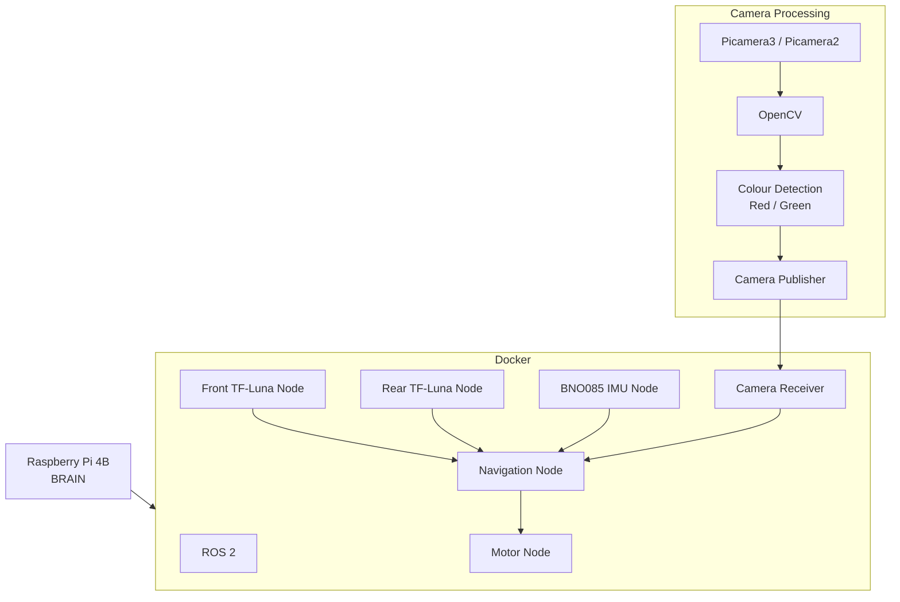

## 3. Software architecture and obstacle strategy

### How our software evolved

Our software started as a small Python program where most of the robot's functions were handled together. This worked for early testing, but as we added more sensors and more complicated navigation, it became harder to debug and understand.

We originally split the program into separate files for movement, sensors and the two competition rounds. However, this still made debugging more difficult because different parts of the program were closely connected.

For our final system, we moved to **ROS 2**. This allows us to separate the robot into independent nodes, with each node responsible for a specific task. The nodes communicate with each other through ROS topics, allowing the navigation system to receive information from all of the sensors and make movement decisions.

The Raspberry Pi 4B runs ROS 2 inside a Docker environment. We chose Docker because we did not want to replace the Raspberry Pi's operating system with Ubuntu, while still being able to use the ROS 2 environment we needed.

### Final ROS 2 architecture

Our final system contains several main components:

* **Front TF-Luna Node** – reads the front TF-Luna through serial communication and publishes the distance to ROS.
* **Rear TF-Luna Node** – reads the rear TF-Luna through I2C and publishes the distance to ROS.
* **IMU Node** – reads orientation information from the BNO085 and publishes it to ROS.
* **Camera Publisher** – runs outside ROS because we could not reliably use the required Picamera2 libraries inside our ROS/Docker environment. It uses Picamera2 and OpenCV to detect red and green pillars.
* **Camera Receiver** – receives the camera information and publishes it into the ROS system so that the navigation node can use it.
* **Navigation Node** – subscribes to the sensor and camera information and makes the decisions required to complete the Open Challenge, Obstacle Challenge and parking.
* **Motor Node** – receives movement commands and controls the steering and drive motors.

The overall system can be represented as:

### Camera and colour detection

The camera system runs separately from ROS. Picamera2 provides access to the Raspberry Pi Camera Module 3 Wide, while OpenCV processes the images.

The camera publisher looks for the colour ranges that we tuned for the competition environment. It identifies whether red or green is present and also records the approximate X position of the detected colour.

The information sent by the camera publisher includes:

* `GREEN` – whether green has been detected.
* `GREEN_X` – the approximate horizontal position of green.
* `RED` – whether red has been detected.
* `RED_X` – the approximate horizontal position of red.

The Camera Receiver then takes this information and publishes it into ROS for the Navigation Node.

We chose this approach instead of trying to run the entire camera pipeline inside ROS because we could not reliably install and use the required Picamera2 libraries inside our ROS/Docker environment. Although this creates an interface between the camera system and ROS, we did not observe noticeable latency during testing.

### Open Challenge logic

For the Open Challenge, the Navigation Node uses the TF-Luna sensors and BNO085 orientation information to control the robot.

The robot uses its navigation and turn logic to:

* Drive forward.
* Detect when a turn is required.
* Use the BNO085 to measure the angle of the robot during a turn.
* Complete approximately 90-degree turns.
* Establish a new heading after completing a turn.
* Repeat the process to complete the required laps.

Reducing the robot's speed to 0.2 was an important part of making this behaviour more repeatable. At higher speeds the robot could complete the course faster, but small errors in steering and turning became much larger. Slowing down gave us better control and improved consistency.

### Obstacle Challenge logic

The Obstacle Challenge uses the same basic navigation system but adds colour information from the camera.

The camera detects the red and green pillars and sends their positions to the Navigation Node. The navigation code uses this information to determine which direction it needs to turn.

The process is:

1. Capture an image using the Pi Camera.
2. Process the image using OpenCV.
3. Detect the relevant red or green colour.
4. Determine where the colour is located in the image.
5. Send the detection to the Camera Receiver.
6. Publish the information into ROS.
7. The Navigation Node decides whether the robot should turn left or right.
8. The Motor Node carries out the movement.

We chose colour detection rather than a more complicated object-detection system because the competition only required us to identify specific red and green pillars. This made the system lighter, easier to tune and easier to debug.

### BNO085 fault recovery

The BNO085 is important to our navigation because it provides orientation information. However, during testing we found that the sensor could occasionally produce invalid information or disconnect.

Rather than allowing the robot to continue driving using unreliable orientation data, we added fault handling to the IMU Node.

When the code detects that the BNO085 has failed, it attempts to restart the sensor. If the sensor cannot be recovered, the robot stops rather than continuing to drive without reliable orientation information.

This was an important reliability decision because a robot continuing to move without trustworthy sensor information could turn a small sensor failure into a much larger navigation failure.

### Parking behaviour

Parking is handled after the required laps and obstacle navigation have been completed.

The rear TF-Luna gives the robot information about the distance behind it. The Navigation Node uses this information while performing the parking movements.

The basic approach is:

* Use controlled forward and backward movements.
* Monitor the rear distance.
* Avoid driving into the parking boundary.
* Stop when the robot has reached the required position.

We added and tested parking after the main navigation was working reliably. This allowed us to isolate problems instead of trying to debug the entire competition sequence at once.
