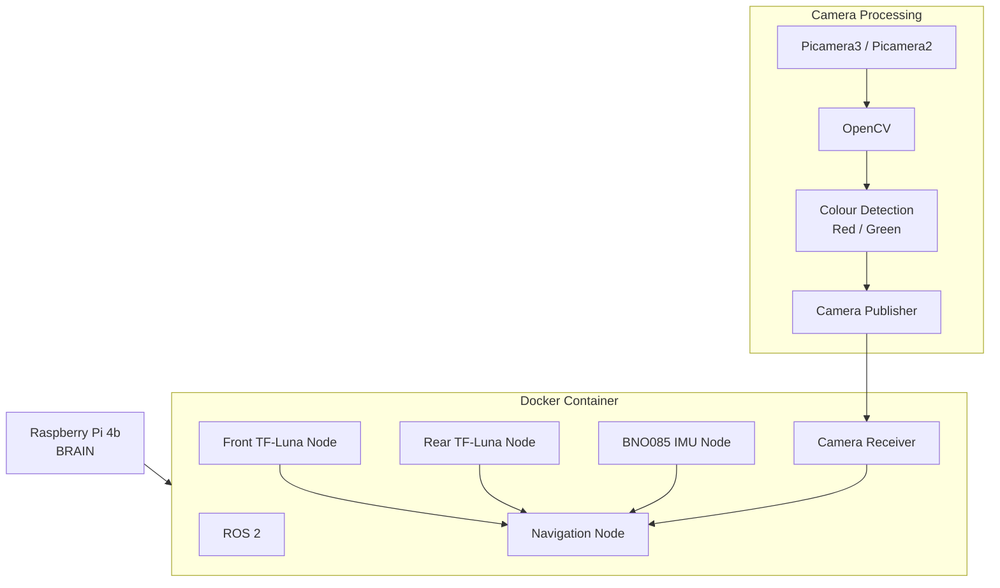

This is our new code that we have used in the European WRO finals in Croatia. We have used ROS which acts like a nervous system, the raspberrypi is the brain and the sensors are like the 6 senses. They help the robot understand where it is and what is around it. We did not want to flash our raspberry pi to ubuntu so we use a docker to bypass this issue. However we later learnt that ubuntu does not have support our picam3. 

Camera publisher takes the values from the picam3(camera) and puts it through a bunch of python libraries, picam2(which gives us camera functionality) and OpenCV(which does the colour recognition). Then the code checks if the value match specific rgb(red,green, blue values) that we have adjusted for green. Then publishes if it is green, where the green is, if it is red, and where the red is.

camera receiver Node.py takes the values from camera publisher and publishes it to the ROS system, for the navigation node to accept and use.

Front TF Luna Node.py takes to values that tf luna/ lidar which is connected via serial communication detects and converts it into floats and broadcasts the information to navigation node.

Rear TF Luna Node.py takes the values from tf luna/lidar in the rear which is connected on i2c detects and  coverts into floats ,like front tf luna node, and broadcasts to the navigation node.

IMU node takes the values from the gyro BNO085 and publishes it. However, our gyro has a nature of giving invalid information to the node, and prints error messages, then the gyro crashes which can be fatal to our code. So what we have done is when the code detects the gyro has crashed, it tries to restart the gyro. And to prevent blind turning or blind driving we stop the robot.

Navigation node subscribes to all the ROS nodes (camera,reciever, Rear TF luna, IMU and Front TF luna node) taking the info that all the sensors see and completes the missions required (no camera publisher as our camera runs outside ROS as we could not get the camera libraries installed on the ROS/docker. Although this could create latency it has not created noticeable latency for us yet. Our navigation node completes both open and obstacle and we can set up the different mode depending on what we want to run. 

The code starts by initializing all the variables (such as mode to decide which round we are completing)
Then subscribes/ takes the broadcasted information ready to use to complete the missions
Then we create the functions like Colour_detection which takes the information from the camera receiver node and decides if it should turn right or turn left.
Then the code calls the navigation loop which runs all the functions to complete everything required.
Then we have our "main" at the bottom which runs the navigation node and if we were to turn it off( using keyboard interrupt which means if we click a key it will disable the code for us) it makes sure to turn off the navigation node.

## Final Software Architecture

ROS 2 acts as the communication layer between our sensor and navigation nodes. The Raspberry Pi 4B acts as the main processing computer.

The camera processing runs outside ROS because we could not reliably run the required Picamera2 libraries inside our ROS Docker environment. The Camera Receiver therefore acts as the interface between the camera system and ROS.

